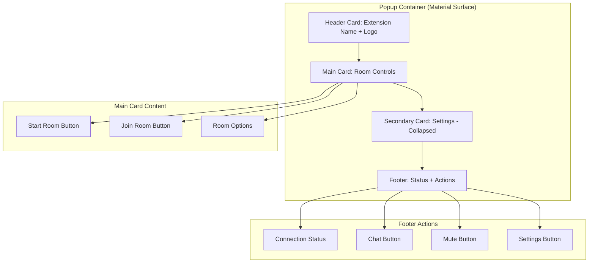
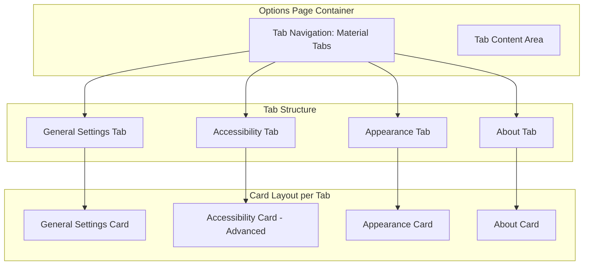
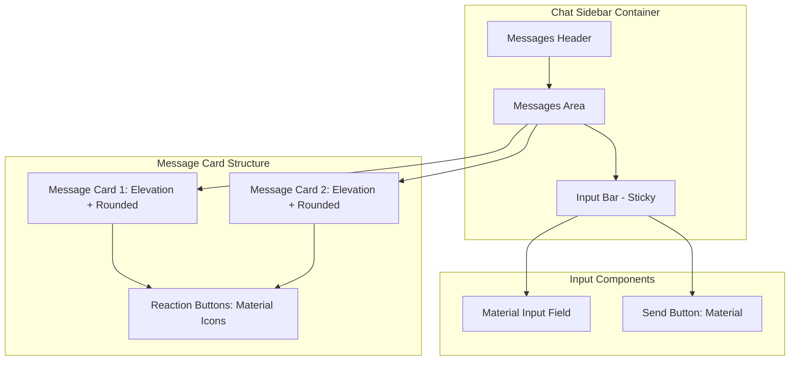

# Design Document

## Overview

The Watch Party Extension is a cross-browser system enabling synchronized video viewing experiences. The architecture follows a client-server model with WebRTC peer-to-peer communication for voice/video and WebSocket signaling for coordination. The system prioritizes configurability, performance, and reliability while supporting both Chrome MV3 and Firefox WebExtensions.

## Architecture

### High-Level Architecture

```mermaid
graph TB
    subgraph "Browser Extension"
        CS[Content Script]
        BG[Background/Service Worker]
        UI[Popup/Options UI]
        VD[@core/video-detector]
        SE[@core/sync-engine]
        AL[@core/annotation-layer]
        BR[@core/browser-bridge]
    end
    
    subgraph "Signaling Server (Full Mode)"
        WS[WebSocket Handler]
        RM[Room Manager]
        DB[(PostgreSQL)]
        REDIS[(Redis Cache)]
    end
    
    subgraph "Local Dev Server (Lightweight Mode)"
        LWS[Local WebSocket Relay]
        MEM[(In-Memory State)]
    end
    
    subgraph "External Services"
        TURN[TURN Server]
        OS[OpenSubtitles API]
        FF[Feature Flags Service]
    end
    
    CS <--> VD
    CS <--> SE
    CS <--> AL
    BG <--> BR
    BG <--> WS
    BG <--> LWS
    BG <--> UI
    SE <--> TURN
    BG <--> OS
    WS <--> RM
    RM <--> DB
    RM <--> REDIS
    BG <--> FF
```

### Component Interaction Flow

1. **Initialization**: Background script loads configuration from extension-config.json and chrome.storage.local
2. **Video Detection**: Content script uses MutationObserver to detect video elements
3. **Room Creation**: User creates room via popup, background script communicates with signaling server
4. **Synchronization**: Sync engine maintains playback state via WebSocket heartbeats and WebRTC data channels
5. **Voice Communication**: WebRTC peer connections established through TURN server coordination

## Components and Interfaces

### Extension Components

#### Browser Bridge (`@core/browser-bridge`)
- **Purpose**: Normalize Chrome and Firefox WebExtension API differences
- **Key Responsibilities**:
  - Provide unified interface for storage, messaging, and permissions
  - Handle Manifest V2/V3 compatibility
  - Abstract browser-specific implementations

```typescript
interface BrowserBridge {
  storage: {
    local: {
      get(keys?: string[]): Promise<Record<string, any>>;
      set(items: Record<string, any>): Promise<void>;
    };
  };
  runtime: {
    sendMessage(message: any): Promise<any>;
    onMessage: {
      addListener(callback: (message: any) => void): void;
    };
  };
  tabs: {
    query(queryInfo: any): Promise<any[]>;
    sendMessage(tabId: number, message: any): Promise<any>;
  };
}
```

#### Background/Service Worker (`background.ts`)
- **Purpose**: Central coordination hub, configuration management, WebSocket connections with robust error handling
- **Key Responsibilities**:
  - Load and merge configuration from files and storage
  - Maintain reliable WebSocket connection with proper reconnection logic
  - Coordinate between content scripts and popup UI with proper message routing
  - Handle feature flag updates and telemetry
  - Implement connection health monitoring with ping/pong

```typescript
interface BackgroundService {
  configManager: ConfigManager;
  signalingClient: SignalingClient;
  roomManager: RoomManager;
  telemetryService: TelemetryService;
  browserBridge: BrowserBridge;
  connectionHealthMonitor: ConnectionHealthMonitor;
}

interface SignalingClient {
  connect(): Promise<void>;
  disconnect(): void;
  isConnected(): boolean;
  sendMessage(message: any): Promise<void>;
  onMessage(callback: (message: any) => void): void;
  onConnectionStateChange(callback: (state: ConnectionState) => void): void;
  startHealthCheck(): void;
  stopHealthCheck(): void;
}

interface ConnectionHealthMonitor {
  startPingPong(): void;
  stopPingPong(): void;
  getConnectionQuality(): ConnectionQuality;
  onHealthChange(callback: (health: ConnectionHealth) => void): void;
}

interface ConfigManager {
  loadConfig(): Promise<ExtensionConfig>;
  updateConfig(updates: Partial<ExtensionConfig>): Promise<void>;
  exportConfig(format: 'json' | 'env' | 'ini'): string;
  importConfig(content: string, format: 'json' | 'env' | 'ini'): Promise<void>;
  loadLocalDevConfig(): Promise<Partial<ExtensionConfig>>; // Auto-loads extension-config.local.json in dev
}
```

#### Content Script (`content-script.ts`)
- **Purpose**: Video detection, DOM manipulation, annotation overlay injection
- **Key Responsibilities**:
  - Coordinate between video detector, sync engine, and annotation layer
  - Communicate video state changes to background script
  - Handle cross-origin limitations gracefully

#### Video Detector (`@core/video-detector`)
- **Purpose**: On-demand video element detection and selection with fallback mechanisms
- **Key Responsibilities**:
  - Remain inactive until user clicks "Start Room"
  - Detect and monitor video elements using MutationObserver when activated
  - Implement right-click fallback detection with parent element traversal
  - Handle detection failures with clear error messaging

```typescript
interface VideoDetector {
  isActive: boolean;
  startDetection(): Promise<VideoElement | null>;
  detectVideos(): VideoElement[];
  selectPrimaryVideo(): VideoElement | null;
  attachVideoListeners(video: VideoElement): void;
  enableRightClickFallback(): void;
  handleRightClick(element: HTMLElement): VideoElement | null;
  traverseParentElements(element: HTMLElement, maxLevels: number): VideoElement | null;
  showDetectionFailedError(): void;
}
```

#### Annotation Layer (`@core/annotation-layer`)
- **Purpose**: Collaborative drawing and markup overlay (separate from sync)
- **Key Responsibilities**:
  - Inject annotation overlay when not blocked by cross-origin policies
  - Render annotations on independent tick cycle from sync heartbeats
  - Handle drawing events and real-time collaboration

```typescript
interface AnnotationLayer {
  injectOverlay(video: VideoElement): boolean;
  renderAnnotations(annotations: Annotation[]): void;
  handleDrawingEvents(): void;
  showFallbackMessage(): void;
  startRenderLoop(): void; // Independent from sync heartbeats
  stopRenderLoop(): void;
}
```

#### Sync Engine (`@core/sync-engine`)
- **Purpose**: Maintain playback synchronization across participants (separate from annotations)
- **Key Responsibilities**:
  - Send and receive heartbeat signals on dedicated sync interval
  - Calculate and correct playback drift
  - Handle reconnection and resynchronization
  - Manage host handoff scenarios

```typescript
interface SyncEngine {
  startSync(video: VideoElement, isHost: boolean): void;
  sendHeartbeat(): void;
  handleSyncMessage(message: SyncMessage): void;
  correctDrift(targetTime: number): void;
  resynchronize(): Promise<void>;
  setSyncInterval(intervalMs: number): void; // Separate from annotation rendering
}

interface SyncMessage {
  type: 'play' | 'pause' | 'seek' | 'heartbeat';
  timestamp: number;
  currentTime: number;
  playbackRate: number;
  userId: string;
}
```

#### Material Design 3 UI Components (`@ui/components/cards/`)
- **Purpose**: Modular Material Design 3 card-based components for consistent UI
- **Key Responsibilities**:
  - Provide reusable Material card components with proper elevation and styling
  - Implement responsive grid layout that adapts to different window sizes
  - Support both light and dark themes with Material Design 3 color system
  - Ensure accessibility compliance with ARIA labels and keyboard navigation

```typescript
interface MaterialCard {
  elevation: 'none' | 'low' | 'medium' | 'high';
  variant: 'elevated' | 'filled' | 'outlined';
  rounded: boolean;
  padding: 'none' | 'small' | 'medium' | 'large';
  children: React.ReactNode;
}

interface PopupCard extends MaterialCard {
  type: 'header' | 'main' | 'secondary' | 'footer';
  collapsed?: boolean;
  onToggle?: () => void;
}

interface OptionsPage {
  loadCurrentConfig(): Promise<ExtensionConfig>;
  saveConfig(config: ExtensionConfig): Promise<void>;
  importConfig(file: File): Promise<void>;
  exportConfig(format: ConfigFormat): void;
  validateConfig(config: Partial<ExtensionConfig>): ValidationResult;
  toggleLocalDevMode(): void;
  toggleAccessibilityMode(): void;
  showAccessibilitySettings(): void;
  hideAccessibilitySettings(): void;
  applyMaterialTheme(theme: 'light' | 'dark'): void;
  renderTabContent(tab: 'general' | 'accessibility' | 'appearance' | 'about'): React.ReactNode;
}

interface PopupUI {
  renderHeaderCard(): React.ReactNode;
  renderMainCard(): React.ReactNode;
  renderSecondaryCard(collapsed: boolean): React.ReactNode;
  renderFooterCard(): React.ReactNode;
  showLoadingState(buttonId: string): void;
  hideLoadingState(buttonId: string): void;
  showSuccessIndicator(message: string): void;
  showErrorIndicator(error: string): void;
  updateConnectionStatus(status: ConnectionState): void;
  applyMaterialAnimations(): void;
}

interface ChatSidebar {
  renderMessageCard(message: ChatMessage): React.ReactNode;
  renderInputBar(): React.ReactNode;
  renderReactionButtons(messageId: string): React.ReactNode;
  applyMaterialStyling(): void;
  handleStickyInput(): void;
}

interface OverlayComponents {
  renderFloatingSurface(content: React.ReactNode): React.ReactNode;
  renderAvatarContainer(avatar: Avatar): React.ReactNode;
  renderReactionIndicator(reaction: Reaction): React.ReactNode;
  applyMaterialElevation(level: number): CSSProperties;
  handleOverlayAnimations(): void;
}
```

### Server Components

#### Signaling Server (`server/signaling.ts`) - Full Mode
- **Purpose**: WebSocket-based room coordination and state management with persistence
- **Key Responsibilities**:
  - Manage room lifecycle and participant connections
  - Relay synchronization messages between participants
  - Handle authentication and authorization
  - Maintain room state in Redis for scalability

```typescript
interface SignalingServer {
  handleConnection(socket: WebSocket): void;
  createRoom(options: RoomOptions): Room;
  joinRoom(roomId: string, userId: string): void;
  broadcastToRoom(roomId: string, message: any, excludeUserId?: string): void;
  handleDisconnection(userId: string): void;
}
```

#### Local WebSocket Relay (`server/local-relay.ts`) - Lightweight Mode
- **Purpose**: Minimal WebSocket relay for localhost development without persistence
- **Key Responsibilities**:
  - Simple message relay between connected clients
  - In-memory room state (no database required)
  - Basic room creation and joining
  - Automatic cleanup on server restart

```typescript
interface LocalWebSocketRelay {
  handleConnection(socket: WebSocket): void;
  createRoom(roomId: string): InMemoryRoom;
  joinRoom(roomId: string, userId: string): void;
  relayMessage(roomId: string, message: any, fromUserId: string): void;
  cleanupRoom(roomId: string): void;
}

interface InMemoryRoom {
  id: string;
  participants: Set<string>;
  hostId: string;
  currentState: PlaybackState;
  createdAt: Date;
}

interface Room {
  id: string;
  hostId: string;
  participants: Map<string, Participant>;
  currentState: PlaybackState;
  settings: RoomSettings;
  createdAt: Date;
  lastActivity: Date;
}
```

#### Room Manager (`server/room-manager.ts`)
- **Purpose**: Persistent room state and participant management
- **Key Responsibilities**:
  - Store room configuration and history in PostgreSQL
  - Cache active room state in Redis
  - Handle room cleanup and TTL expiration
  - Manage participant permissions and roles

```typescript
interface RoomManager {
  createRoom(options: CreateRoomOptions): Promise<Room>;
  getRoom(roomId: string): Promise<Room | null>;
  updateRoomState(roomId: string, state: PlaybackState): Promise<void>;
  addParticipant(roomId: string, participant: Participant): Promise<void>;
  removeParticipant(roomId: string, userId: string): Promise<void>;
  cleanupExpiredRooms(): Promise<void>;
}
```

#### Feature Flags Service (`server/feature-flags.ts`)
- **Purpose**: Dynamic feature control and A/B testing
- **Key Responsibilities**:
  - Serve feature flag configurations to clients
  - Support percentage-based rollouts
  - Provide override capabilities for testing
  - Log flag state changes for audit

```typescript
interface FeatureFlagsService {
  getFlags(userId: string): Promise<FeatureFlags>;
  updateFlag(flagName: string, config: FlagConfig): Promise<void>;
  evaluateFlag(flagName: string, userId: string): boolean;
  logFlagEvaluation(flagName: string, userId: string, result: boolean): void;
}
```

## Data Models

### Core Data Structures

```typescript
interface ExtensionConfig {
  SIGNALING_SERVER: string;
  SIGNALING_WS_PATH: string;
  STUN_SERVERS: string[];
  TURN_SERVERS: TurnServer[];
  OPENSUBTITLES_KEY: string;
  DEFAULT_SUBTITLE_LANGS: string[];
  ROOM_DEFAULT_PASSWORD: string;
  FEATURE_FLAGS: Record<string, boolean>;
  TELEMETRY_ENABLED: boolean;
  SYNC_TOLERANCE_MS: number;
  SYNC_TIMEOUT_MS: number;
  HEARTBEAT_INTERVAL_MS: number;
  ANNOTATION_RENDER_INTERVAL_MS: number; // Separate from sync heartbeat
  RECONNECT_INTERVAL_MS: number;
  ROOM_STATE_TTL_MS: number;
  VIDEO_DETECT_POLL_MS?: number; // Optional fallback polling
  LOCAL_DEV_MODE: boolean; // Use lightweight local relay instead of full server
}

interface PlaybackState {
  currentTime: number;
  paused: boolean;
  playbackRate: number;
  timestamp: number;
  videoUrl?: string;
  duration?: number;
}

interface Participant {
  id: string;
  name: string;
  role: 'host' | 'co-host' | 'participant';
  isConnected: boolean;
  lastSeen: Date;
  permissions: ParticipantPermissions;
}

interface Annotation {
  id: string;
  userId: string;
  timestamp: number; // Video timestamp
  type: 'pen' | 'shape' | 'text';
  data: AnnotationData;
  layer: number;
  visible: boolean;
  createdAt: Date;
}

interface SubtitleTrack {
  id: string;
  userId: string;
  language: string;
  source: 'file' | 'opensubtitles';
  content: string; // SRT/VTT content
  offset: number; // User-specific offset in ms
  enabled: boolean;
}

interface ConnectionState {
  status: 'connected' | 'connecting' | 'disconnected' | 'error';
  lastConnected?: Date;
  reconnectAttempts: number;
  latency?: number;
  error?: string;
}

interface ConnectionHealth {
  quality: 'excellent' | 'good' | 'poor' | 'critical';
  latency: number;
  packetLoss: number;
  lastPingTime: Date;
  consecutiveFailures: number;
}

interface VideoDetectionResult {
  success: boolean;
  video?: VideoElement;
  method: 'automatic' | 'right-click' | 'manual';
  error?: string;
  fallbackAvailable: boolean;
}
```

### Database Schema

```sql
-- PostgreSQL schema
CREATE TABLE rooms (
  id VARCHAR(255) PRIMARY KEY,
  host_id VARCHAR(255) NOT NULL,
  name VARCHAR(255),
  password_hash VARCHAR(255),
  is_public BOOLEAN DEFAULT false,
  max_participants INTEGER DEFAULT 50,
  settings JSONB,
  created_at TIMESTAMP DEFAULT NOW(),
  updated_at TIMESTAMP DEFAULT NOW()
);

CREATE TABLE participants (
  id VARCHAR(255) PRIMARY KEY,
  room_id VARCHAR(255) REFERENCES rooms(id) ON DELETE CASCADE,
  user_id VARCHAR(255) NOT NULL,
  role VARCHAR(50) DEFAULT 'participant',
  joined_at TIMESTAMP DEFAULT NOW(),
  last_seen TIMESTAMP DEFAULT NOW()
);

CREATE TABLE room_events (
  id SERIAL PRIMARY KEY,
  room_id VARCHAR(255) REFERENCES rooms(id) ON DELETE CASCADE,
  user_id VARCHAR(255),
  event_type VARCHAR(100) NOT NULL,
  event_data JSONB,
  timestamp TIMESTAMP DEFAULT NOW()
);

CREATE TABLE annotations (
  id VARCHAR(255) PRIMARY KEY,
  room_id VARCHAR(255) REFERENCES rooms(id) ON DELETE CASCADE,
  user_id VARCHAR(255) NOT NULL,
  video_timestamp DECIMAL(10,3) NOT NULL,
  annotation_type VARCHAR(50) NOT NULL,
  annotation_data JSONB NOT NULL,
  layer_index INTEGER DEFAULT 0,
  created_at TIMESTAMP DEFAULT NOW()
);
```

## UI/UX Design Principles

### Material Design 3 Architecture

The extension implements a comprehensive Material Design 3 system with card-based layouts and modern aesthetics:

1. **Design Framework**: Material Design 3 (MD3) components with elevation-based shadows, rounded corners (12-16px), and soft transitions using responsive grid layout
2. **Typography**: Primary font Roboto or Inter with Material Design 3 type scale and consistent hierarchy
3. **Color System**: 
   - Primary: #6200EE
   - Secondary: #03DAC6  
   - Surface: #FFFFFF (light) / #121212 (dark)
   - Error: #B00020
4. **Spacing System**: Consistent 8/16/24 dp spacing with subtle motion animations on hover/click interactions
5. **Component Architecture**: All UI components modular under `/ui/components/cards/` following accessibility standards with ARIA labels and keyboard focus

### Popup UI Design

The popup interface follows a clean Material card structure:



### Options Page Design

The options page uses a tabbed Material layout with organized sections:



### Chat Sidebar Design

The chat interface uses card-style message bubbles with Material styling:



### Visual Assets Architecture

The extension will include a comprehensive asset system organized for maintainability and performance:

```
assets/
├── icons/
│   ├── toolbar/          # Extension toolbar icons (16x16, 32x32, 48x48)
│   ├── popup/            # Popup UI icons (play, pause, chat, mic, etc.)
│   ├── reactions/        # Reaction icons (heart, laugh, surprise, etc.)
│   └── ui/               # General UI icons (settings, close, expand, etc.)
├── avatars/
│   ├── placeholders/     # Colored avatar placeholders (6-8 variants)
│   └── animations/       # Avatar action GIFs (wave, laugh, idle)
├── animations/
│   ├── loading/          # Spinner and loading animations
│   └── transitions/      # UI transition effects
├── backgrounds/
│   ├── blur-overlays/    # Modal and popup background blurs
│   └── gradients/        # Subtle gradient backgrounds
└── logo/
    ├── main/             # Primary extension logo variants
    ├── light-theme/      # Light theme optimized versions
    └── dark-theme/       # Dark theme optimized versions
```

### Icon Font Integration

The extension will use Font Awesome or similar icon font for scalable, consistent iconography:

1. **Local Bundling**: Icon font files bundled with extension for offline functionality
2. **Fallback System**: SVG or PNG fallbacks when font loading fails
3. **Performance**: Subset font to include only required icons
4. **Accessibility**: Proper ARIA labels and semantic markup for screen readers

### Asset Optimization Guidelines

1. **File Formats**: SVG for scalable icons, PNG for complex graphics, GIF for simple animations
2. **Size Limits**: Individual assets <50KB, total asset bundle <2MB
3. **DPI Support**: 1x, 2x, and 3x variants for high-density displays
4. **Compression**: Optimized with tools like SVGO, ImageOptim, or similar
5. **Licensing**: Only MIT, Apache 2.0, or CC0 licensed assets

### Accessibility Integration

Accessibility features will be thoughtfully integrated without cluttering the main interface:

1. **Progressive Disclosure**: Accessibility options hidden by default, revealed through dedicated settings toggle
2. **Settings Organization**: Accessibility controls grouped in collapsible sections within options page
3. **Visual Indicators**: Clear icons and labels to identify accessibility-enhanced elements
4. **Graceful Enhancement**: Core functionality works without accessibility mode, enhanced when enabled

### User Feedback and States

All user interactions will provide clear, immediate feedback:

1. **Button States**: Loading spinners, success checkmarks, error indicators with descriptive messages
2. **Connection Status**: Visual indicators for WebSocket connection state (connected/connecting/disconnected/error)
3. **Progress Indicators**: Clear feedback for long-running operations (room creation, video detection)
4. **Error Recovery**: Actionable error messages with retry buttons and troubleshooting guidance

```typescript
interface UIState {
  connectionStatus: 'connected' | 'connecting' | 'disconnected' | 'error';
  buttonStates: Record<string, 'idle' | 'loading' | 'success' | 'error'>;
  accessibilityMode: boolean;
  theme: 'light' | 'dark' | 'auto';
  notifications: NotificationMessage[];
  materialTheme: MaterialThemeConfig;
  cardStates: Record<string, CardState>;
}

interface MaterialThemeConfig {
  palette: MaterialPalette;
  spacing: MaterialSpacing;
  shape: MaterialShape;
  elevation: MaterialElevation;
  typography: MaterialTypography;
}

interface MaterialPalette {
  primary: ColorVariant;
  secondary: ColorVariant;
  surface: ColorVariant;
  error: ColorVariant;
  background: string;
  onSurface: string;
  onPrimary: string;
}

interface ColorVariant {
  main: string;
  light: string;
  dark: string;
  contrastText: string;
}

interface CardState {
  id: string;
  collapsed: boolean;
  elevation: 'none' | 'low' | 'medium' | 'high';
  loading: boolean;
  error?: string;
}

interface NotificationMessage {
  id: string;
  type: 'success' | 'error' | 'warning' | 'info';
  message: string;
  action?: {
    label: string;
    callback: () => void;
  };
  autoHide?: boolean;
  duration?: number;
  materialVariant: 'filled' | 'outlined' | 'standard';
}

interface ChatMessage {
  id: string;
  userId: string;
  content: string;
  timestamp: Date;
  reactions: Reaction[];
  materialStyling: {
    elevation: number;
    variant: 'sent' | 'received';
    borderRadius: number;
  };
}

interface Reaction {
  id: string;
  emoji: string;
  userId: string;
  timestamp: Date;
  materialIcon: string;
}

interface OverlayConfig {
  surface: {
    elevation: number;
    opacity: number;
    borderRadius: number;
    backdropBlur: number;
  };
  animation: {
    duration: number;
    easing: string;
    type: 'fade' | 'slide' | 'scale';
  };
}
```

## Error Handling

### Client-Side Error Handling

1. **Connection Errors**:
   - Exponential backoff for reconnection attempts
   - Graceful degradation when WebRTC fails
   - Clear user messaging for network issues

2. **Cross-Origin Limitations**:
   - Detect iframe/shadow DOM restrictions
   - Provide fallback UI with guidance
   - Attempt injection with all_frames permission

3. **Video Detection Failures**:
   - Right-click fallback detection with parent element traversal
   - Clear error messaging when detection fails completely
   - User guidance for manual video selection
   - Retry mechanisms with exponential backoff

4. **Configuration Errors**:
   - Validate configuration on import
   - Provide clear error messages for invalid values
   - Fallback to default values when possible

### Server-Side Error Handling

1. **WebSocket Connection Management**:
   - Implement proper ping/pong heartbeat mechanism
   - Handle connection drops gracefully with exponential backoff reconnection
   - Maintain room state during temporary disconnections
   - Clean up resources on permanent disconnections
   - Validate all incoming messages and reject malformed data
   - Provide detailed error responses for debugging

2. **Database Resilience**:
   - Connection pooling and retry logic
   - Graceful degradation when database is unavailable
   - Redis fallback for critical room state

3. **External Service Failures**:
   - OpenSubtitles API timeout and retry handling
   - TURN server fallback configurations
   - Feature flag service degradation

## Testing Strategy

### Unit Testing

1. **Sync Engine Tests**:
   - Property-based testing for drift correction algorithms
   - Deterministic scenarios for seek operations
   - Edge cases for reconnection and resync

2. **Video Detection Tests**:
   - Mock DOM scenarios with various video configurations
   - Cross-origin iframe simulation
   - Platform player integration testing

3. **Configuration Management Tests**:
   - Import/export format validation
   - Configuration merging logic
   - Storage persistence verification

### Integration Testing

1. **End-to-End Synchronization**:
   - Multi-participant sync scenarios
   - Host handoff and role changes
   - Network interruption simulation

2. **WebRTC Communication**:
   - Peer connection establishment
   - TURN server fallback scenarios
   - Audio quality and latency testing

3. **Cross-Browser Compatibility**:
   - Chrome MV3 vs Firefox WebExtension differences
   - Manifest v2/v3 compatibility layers
   - Permission handling variations

### Performance Testing

1. **Memory Usage**:
   - Long-running session monitoring
   - Memory leak detection
   - Resource cleanup verification

2. **Network Efficiency**:
   - Bandwidth usage optimization
   - Message compression effectiveness
   - Heartbeat frequency tuning

3. **Scalability Testing**:
   - Room capacity limits
   - Server connection handling
   - Database query performance

### Mutation Testing

1. **Critical Path Coverage**:
   - Sync algorithm mutations
   - Error handling path verification
   - Configuration validation logic

2. **Property-Based Test Enhancement**:
   - Generate edge cases for video detection
   - Stress test synchronization boundaries
   - Validate error recovery mechanisms

## Security Considerations

### Extension Security

1. **Content Security Policy**:
   - Strict CSP for extension pages
   - Sanitization of injected content
   - XSS prevention in annotation rendering

2. **Permission Minimization**:
   - Justify each manifest permission
   - Use optional permissions where possible
   - Clear user consent for sensitive operations

3. **Data Sanitization**:
   - Validate subtitle file content
   - Sanitize annotation data
   - Prevent code injection in chat messages

### Server Security

1. **Authentication & Authorization**:
   - JWT token validation
   - Role-based access control
   - Rate limiting for API endpoints

2. **Data Protection**:
   - Encrypt sensitive data at rest
   - Secure WebSocket connections (WSS)
   - Optional E2E encryption for chat

3. **Input Validation**:
   - Validate all WebSocket messages
   - Sanitize room names and descriptions
   - Prevent SQL injection in database queries

## Deployment Configuration

### Environment Variables

The system uses a layered configuration approach:

1. **Server Configuration** (`.env`):
   - Database and Redis connection strings
   - TURN server credentials
   - API keys and secrets
   - Feature flag endpoints

2. **Extension Configuration** (`extension-config.json`):
   - Client-side defaults for all configurable values
   - Feature flag overrides
   - Timing and performance parameters

3. **Runtime Overrides** (`chrome.storage.local`):
   - User-customized settings from Options page
   - Imported configuration values
   - Per-user preferences

### Configuration Precedence

1. Runtime overrides from Options page (highest priority)
2. Local development config (`extension-config.local.json` when NODE_ENV=development)
3. Extension config file defaults (`extension-config.json`)
4. Hardcoded fallback values (lowest priority)

### Material Design 3 Implementation Architecture

The extension uses a React + Tailwind + Material UI hybrid setup for optimal performance and consistency:

#### Technology Stack
- **React**: Component-based UI with hooks for state management
- **Tailwind CSS**: Utility-first CSS framework for rapid styling
- **Material UI**: Pre-built Material Design 3 components
- **TypeScript**: Type safety and better developer experience

#### Component Structure
```
src/@ui/components/cards/
├── base/
│   ├── MaterialCard.tsx          # Base card component with elevation
│   ├── MaterialButton.tsx        # Consistent button styling
│   ├── MaterialInput.tsx         # Form input components
│   └── MaterialIcon.tsx          # Icon wrapper component
├── popup/
│   ├── HeaderCard.tsx            # Extension name + logo
│   ├── MainCard.tsx              # Room creation/join options
│   ├── SecondaryCard.tsx         # Collapsible settings
│   └── FooterCard.tsx            # Status + action buttons
├── options/
│   ├── TabContainer.tsx          # Material tabs wrapper
│   ├── GeneralSettingsCard.tsx   # General configuration
│   ├── AccessibilityCard.tsx     # Accessibility options
│   ├── AppearanceCard.tsx        # Theme and color settings
│   └── AboutCard.tsx             # Version and info
├── chat/
│   ├── MessageCard.tsx           # Individual message bubbles
│   ├── InputBar.tsx              # Sticky input with send button
│   └── ReactionButtons.tsx       # Emoji reaction controls
└── overlays/
    ├── FloatingSurface.tsx       # Base overlay container
    ├── AvatarContainer.tsx       # Avatar display wrapper
    └── ReactionIndicator.tsx     # Video reaction overlays
```

#### Theme Configuration
```typescript
interface MaterialTheme {
  palette: {
    primary: {
      main: '#6200EE';
      light: '#7C4DFF';
      dark: '#3700B3';
    };
    secondary: {
      main: '#03DAC6';
      light: '#66FFF9';
      dark: '#00A896';
    };
    surface: {
      light: '#FFFFFF';
      dark: '#121212';
    };
    error: {
      main: '#B00020';
    };
  };
  spacing: {
    unit: 8; // 8dp base unit
    small: 8;
    medium: 16;
    large: 24;
  };
  shape: {
    borderRadius: {
      small: 8;
      medium: 12;
      large: 16;
    };
  };
  elevation: {
    none: 0;
    low: 2;
    medium: 4;
    high: 8;
  };
}
```

### Module Organization

The extension follows a package-based module structure optimized for Material Design 3:

```
extension/
├── src/
│   ├── @core/
│   │   ├── browser-bridge/
│   │   ├── sync-engine/
│   │   ├── video-detector/
│   │   └── annotation-layer/
│   ├── @ui/
│   │   ├── components/
│   │   │   └── cards/           # Material Design 3 components
│   │   ├── themes/
│   │   │   ├── material.ts      # Material Design 3 theme
│   │   │   └── colors.ts        # Color palette definitions
│   │   ├── options/
│   │   │   └── OptionsPage.tsx  # Tabbed settings interface
│   │   ├── popup/
│   │   │   └── PopupApp.tsx     # Card-based popup
│   │   └── chat/
│   │       └── ChatSidebar.tsx  # Material chat interface
│   ├── content-script.ts
│   └── background.ts
├── assets/                      # Material Design 3 optimized assets
├── extension-config.json
├── extension-config.local.json (auto-loaded in dev)
└── extension-config.example.json
```

### Local Development Mode

When `LOCAL_DEV_MODE: true` or `NODE_ENV=development`:
- Extension connects to lightweight local WebSocket relay
- No PostgreSQL/Redis dependencies required
- In-memory room state with automatic cleanup
- Simplified TURN configuration (STUN-only acceptable)
- Auto-loads `extension-config.local.json` for developer overrides

This design ensures that deployment configuration can be modified without code changes while maintaining sensible defaults, user customization capabilities, and streamlined local development.